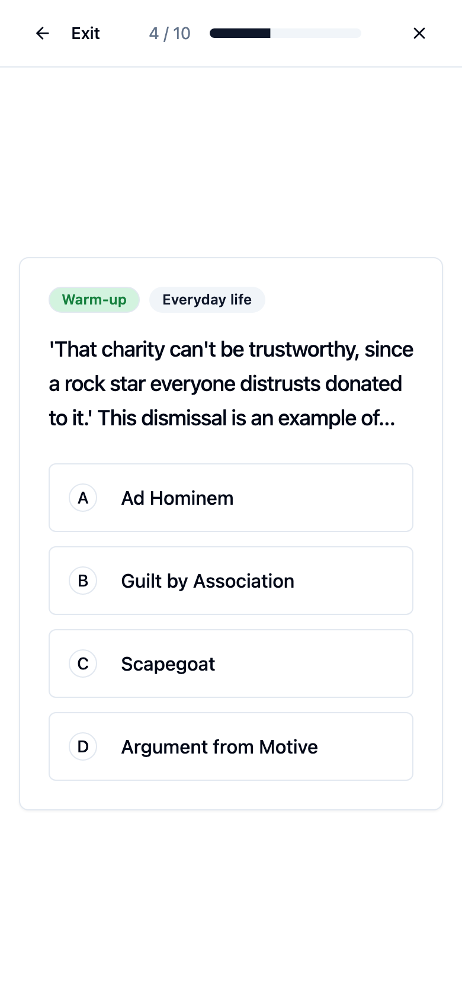
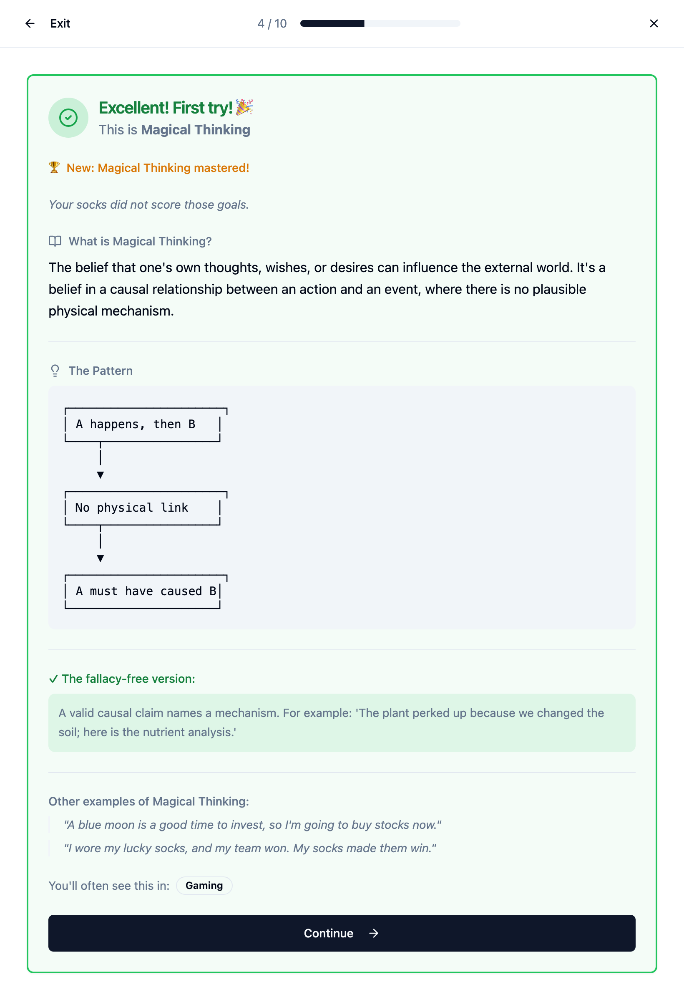

# Spot The Fallacy

**Train your eye for bad arguments.**

SpotTheFallacy.com is a practice tool for learning to spot logical fallacies: the flawed reasoning patterns that show up in politics, advertising, social media, and everyday conversations. You read a short scenario, name the fallacy, and get an instant explanation of why the answer is right or wrong.

<p align="center">
  
  &nbsp;&nbsp;&nbsp;&nbsp;
  
</p>
<p align="center">
  <sub>Left: mid-session on mobile. Right: the feedback after a correct answer: zinger, the pattern as a diagram, a fallacy-free version, and where you'll see it in real life.</sub>
</p>

## How It Works

### Six ways to practice

1. **Training Mode** (recommended)
   - 10 questions per session, no time pressure
   - Wrong answers can be retried; explanations for every answer
   - Questions you have missed weigh 4x, unseen fallacies 2x — including
     mistakes you retried your way out of

2. **Challenge Mode**
   - Questions only from fallacies you have not yet mastered
   - 30 seconds per question, one attempt, no retries
   - Every score is saved; the summary shows your personal best

3. **Today's 5** (daily challenge)
   - 5 questions, same set for everyone on that date
   - One attempt; the store refuses a second entry for the same day

4. **Quick Round**
   - 3 questions, about a minute

5. **Category Focus**
   - Practice one category: Personal Attack, Faulty Logic, Emotional Manipulation, Misrepresentation, False Authority, Causal Errors

6. **Context Focus**
   - Practice where fallacies actually appear: Politics, Social Media, Advertising, Science, Relationships, Business, Entertainment, Gaming, School, Everyday life

### Feedback that teaches

Every answer gets an explanation. Wrong answers show what you picked, why it does not fit, and which fallacy the argument actually is. Right answers add the full picture: the pattern as an ASCII flow diagram, a fallacy-free version of the argument, other examples, and the everyday names the fallacy also goes by.

A dry one-liner comes with each fallacy. Two favorites: "The coin has no memory. It's not mad at you." and "Scary music is not evidence."

### The Feynman prompt

Every third consecutive first-try correct answer, the app asks you to explain
the fallacy in your own words. There is no scoring; writing the explanation is
the exercise.

### Progress that stays on your device

- Mastery per fallacy: mastered at 90%+, still learning below 70%
- A stamp and a small confetti burst when a fallacy crosses the mastery line
- Day streak, session history, and per-category breakdowns
- Export and import for backups; upgrades migrate saved progress automatically

### Keyboard play

Press 1-4 to answer, Enter to continue. The whole game is playable without a mouse.

### Install it like an app

The site is a PWA, so it can live on a home screen or in its own window instead
of a browser tab:

- **Android / Chrome / Edge**: an install button appears in the address bar, or
  use the browser menu. The app gets its own icon, its own window with no browser
  chrome, and a launch screen built from the app name and icon.
- **iPhone / iPad**: Share, then Add to Home Screen. iOS does not offer an
  install prompt, and it uses the `apple-touch-icon` for the home screen icon.
- **Desktop**: installs as a standalone window from the address bar icon.

Once installed it opens without a network connection: the app shell is cached by
a service worker on first load, and a new version is picked up in the background
and applied on the next launch.

## What You Get

- **40+ logical fallacies**, each with a specific pattern diagram, a valid version of the argument, and key terms
- **120+ practice questions**, 3 per fallacy, written for school, work, media, and internet life
- **Wrong options that teach**: distractors are the fallacies each one is most often confused with
- **Mastery-weighted question selection** in Training Mode
- **Installs as an app** on a phone or desktop, and works offline once loaded
- **Private by design**: all progress stays in your browser; nothing is sent to a server
- **Free, no ads, no accounts**

## Tech Stack

- React + TypeScript + Vite
- Tailwind CSS + shadcn-ui
- localStorage for all progress (with schema migrations)
- `vite-plugin-pwa` for the web app manifest and service worker
- Vitest for unit tests; three Playwright harnesses for end-to-end checks

## Design Decisions

Short notes on why things are the way they are. Several of these replaced
earlier designs; the reasoning is recorded so they do not get reinvented.

**Client-only, no backend.** All progress lives in localStorage under one key
(`fallacy_trainer_progress`). No accounts, no network calls, nothing to host
except static files. Cost: progress is per-device, and export/import is the only
backup. 

**Installable, and offline after the first load.** `vite-plugin-pwa` generates
the web app manifest and the service worker at build time, so the manifest is
never hand-written and the service worker is never committed. The app shell is
precached, which is what makes an installed copy launch without a network.
Costs, all deliberate:

- The service worker is disabled in dev. Testing install or offline behaviour
  needs `npm run build && npm run preview`; running it against the dev server
  would also mean the copy and critic harnesses sometimes test a cached bundle
  instead of the working tree.
- Manifest icons are generated from the logo by
  `scripts/generate-pwa-assets.py`, because the source logo is a lockup with a
  wordmark that is unreadable at icon sizes. Icons use the mark alone.
- iOS launch images are **off by default** (`--ios-splash` turns them on). They
  are 20 device-specific PNGs and over a megabyte, fetched only when an
  installed iOS app launches, whereas Chrome and Android build their launch
  screen from the manifest for free. iOS through Safari also ignores the
  manifest, so it needs the `apple-*` meta tags to behave like an app.

**Mastery-weighted selection, not a difficulty ladder.** An earlier version
adapted a numeric difficulty level up and down with performance. It was retired
because the same adjustment falls out of weighting instead: a fallacy you have
missed weighs 4x, one you have never seen weighs 2x, everything else 1x. A
ladder also had to be persisted and explained; the weights are derived from
stats that were already being recorded.

**One daily attempt per date, enforced in the progress store.** The menu hides
an already-played daily, but that is presentation. `recordDailyResult` refuses a
second write for a date, so a stale tab, a replay path, or a second browser
tab cannot inflate the history or break the "same set for everyone" promise.
The set itself is generated from a date-seeded PRNG.

**The Feynman prompt is unscored.** It used to award points for keyword matches,
which turned a reflection exercise into a guessing game. Writing the
explanation is the exercise; the app does not grade it.

**One progress store, versioned, with content migrations.** Fallacies get
renamed and merged, so stored per-fallacy stats are remapped through
`FALLACY_KEY_MIGRATION` (chains are followed) on every load. `schemaVersion`
marks the shape. Transient UI state (which fallacy just crossed into mastery)
is deliberately never persisted.

**Content is data, and the tests are the gate.** `fallacies.json` and
`quiz-questions.json` are the source of truth; categories, pattern diagrams,
valid versions, per-option explanations, distractors, contexts, and difficulty
are derived at load. Diagrams, brevity limits, banned phrases, option integrity,
and context sanity are enforced by tests, so a content change cannot land
half-done.

## For Developers

```bash
npm install        # install dependencies
npm run dev        # dev server on http://localhost:8080
npm run test       # unit + copy-quality + context tests
npm run lint       # eslint
npm run build      # production build
npx tsc --noEmit -p tsconfig.app.json   # typecheck
```

All four of `test`, `lint`, `build`, and the typecheck should be green before a
change lands.

The end-to-end harnesses are local Python tools and are **not** npm
dependencies. They need a running dev server and Playwright for Python:

```bash
pip install playwright && playwright install chromium
npm run dev &
python3 scripts/critic_harness.py <round>   # plays Challenge and Training end to end
python3 scripts/copy_harness.py <round>     # screenshots 35+ screen/viewport combos
```
Both write screenshots and a `report.json` to `.critic/<round>/` (gitignored),
and both fail loudly on text overflow, wrong feedback states, or a broken
timer.

A third harness checks the PWA. It needs a **build**, not the dev server,
because that is the only place a service worker exists:

```bash
npm run build && npm run preview &
python3 scripts/pwa_harness.py             # manifest, icons, service worker, offline
```

If the logo changes, regenerate the icon set and commit the result:

```bash
python3 scripts/generate-pwa-assets.py   # public/icons/*
```

## Project Structure

```
src/
├── components/
│   ├── training/    # Session UI: question, feedback, Feynman, summary, modes
│   ├── stats/       # Progress dashboard
│   ├── settings/    # Export / import / reset
│   └── ui/          # shadcn-ui components
├── hooks/
│   ├── useProgress.tsx        # single progress store (context) + localStorage
│   └── useLearningEngine.ts   # sessions, selection, timer, answers
├── data/
│   ├── fallacies.json         # fallacy catalog (names, descriptions, examples)
│   ├── quiz-questions.json    # question scenarios and options
│   ├── enhancedData.ts        # derives categories, diagrams, explanations
│   └── types.ts               # TypeScript definitions
├── test/                      # vitest suites (incl. copy quality gates)
└── pages/Index.tsx            # app shell and navigation

public/
├── icons/             # PWA icon set, generated from images/logo.png
├── images/            # logo source and social preview card
├── favicon.ico        # 16/32/48 favicon
└── favicon-32.png     # 32px favicon

scripts/
├── generate-pwa-assets.py     # rebuilds public/icons/* from the logo
├── critic_harness.py          # E2E: plays Challenge and Training modes
├── copy_harness.py            # layout: overflow checks across viewports
└── pwa_harness.py             # manifest, service worker, offline launch
```

`vite.config.ts` holds the PWA configuration (manifest fields, precache
patterns, SPA navigation fallback) alongside the chunk-splitting rules.

## Adding a Fallacy

1. Add the entry to `src/data/fallacies.json` (name, description, 2 examples)
2. Add 3 questions to `src/data/quiz-questions.json` (every option must be a real fallacy name)
3. Wire it through `src/data/enhancedData.ts`: category, pattern diagram, valid version, key terms, confusion pairs
4. `npm run test` enforces the rest: diagram uniqueness and width, explanation integrity, brevity limits, and banned-phrase linting

## Contributing

The code is at **[github.com/AUAggy/SpotTheFallacy](https://github.com/AUAggy/SpotTheFallacy)**.

Found a bug or a mislabeled question? [Open an issue](https://github.com/AUAggy/SpotTheFallacy/issues/new/choose) or a PR. There are templates for bug reports and for content corrections, and you do not need a GitHub account to contribute: email hello+spotthefallacy@miaggy.com instead.

Content changes run through the copy-quality tests, so a scenario fix needs
the explanation and the diagram to hold up too, not just the wording.

## License

AGPL-3.0. Free to use, share, and modify. The one condition that matters:
if you run a modified version of this app publicly (including on your own
site), you must make your modified source available under the same license.

Copyright © 2026 miaggy.com

## Credits

Built on Richard Feynman's teaching principle: if you can't explain it simply, you don't understand it well enough.

---

**Start training at [SpotTheFallacy.com](https://spotthefallacy.com)**

Source, bugs and content corrections: [github.com/AUAggy/SpotTheFallacy](https://github.com/AUAggy/SpotTheFallacy)
